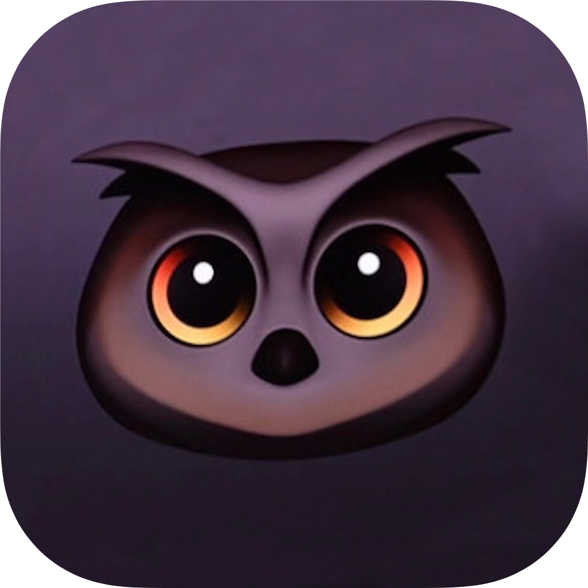

# Dark Mode (NSLondon Talk) [iPadOS app]

> A presentation about the iOS 13 Dark Mode feature that was actually an iPadOS app to demonstrate first hand how easy it is to support.

A rough-working version of a makeshift subtitles effect is also included, though this did not work during the presentation due to environmental audio/microphone issues.

## Requirements 
* Xcode 11
* iOS 13+
* Requires the "SF-Pro-Rounded-Regular.otf" Apple font for full Storyboard support
* Microphone access to get the live-talking subtitles working, though not required to view slides
* Optimised for iPad Pro 10.5"

## Privacy
[Privacy Policy](https://github.com/SunburstEnzo/Privacy-Policy)

No analytics whatsoever. 

## Notes
Intended for reference only. 

## References

* Original app icon based off Apple's Dark Mode reference icon used in their WWDC 2019 talk, a modification of their Owl Animoji. 
* Screenshots of Xcode and the iOS Calculator app belong to Apple.
* Autooth app is Copyright Aled Samuel.
* Screenshots of DuckDuckGo belong to DuckDuckGo.
* Life dark mode tweet screenshot belongs to azraa hendricks (@azraahendricks_) from Twitter.
* Thanks to Vidit Bhargava and Max Rudberg for their article references.
